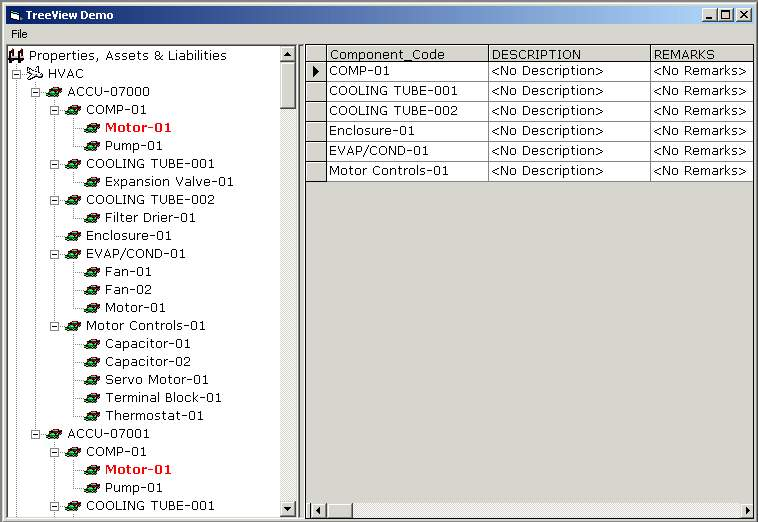



## Treeview Manipulation

### Description

This application illustrates basic manipulation of the treeview control like populating a treeview with items from a database, expanding the treeview nodes manually by clicking or by automatically by code, searching a tree for an item and others. This also illustrates how to simply create a splitter by using pure vb code. Please give feedbacks.
 
### More Info
 

             |
---                |---
**Submitted On**   |2003-02-07 14:32:40
**By**             |[Erick Asas](https://github.com/Planet-Source-Code/PSCIndex/blob/master/ByAuthor/erick-asas.md)
**Level**          |Beginner
**User Rating**    |4.4 (35 globes from 8 users)
**Compatibility**  |VB 6\.0
**Category**       |[Databases/ Data Access/ DAO/ ADO](https://github.com/Planet-Source-Code/PSCIndex/blob/master/ByCategory/databases-data-access-dao-ado__1-6.md)
**World**          |[Visual Basic](https://github.com/Planet-Source-Code/PSCIndex/blob/master/ByWorld/visual-basic.md)
**Archive File**   |[Treeview\_M154102282003\.zip](https://github.com/Planet-Source-Code/erick-asas-treeview-manipulation__1-43039/archive/master.zip)

